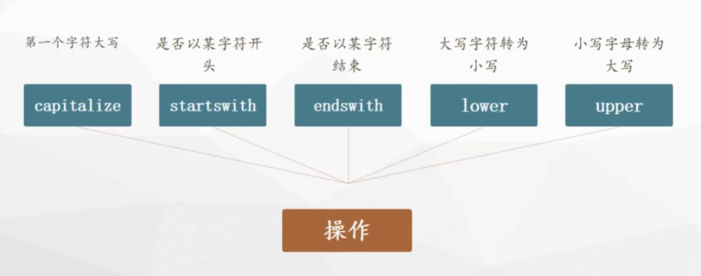

# myPython


<h3 style="color:orange;">Python可以干什么？</h3>

<h5 style="color:#ff4c00;">网络爬虫</h5>


<h5 style="color:#c91f37;">网站开发</h5>


<h5 style="color:#ff0097;">数据分析</h5>


<h5 style="color:#f20c00;">自动化办公</h5>


## 安装Python与PyCharm

[Python官网](https://www.python.org)

**1、python解释器：略**

相关命令：

```sh
# 在命令行中启用Python
python

# 查看Python版本
python -V

# 查看Python安装位置
where python
```


**2、pycharm编辑器：略**


## 入门程序

### 1、认识Python

<span style="color:blue;">Python语言</span>是一种<span style="color:red;">面向对象</span>的<span style="color:red;">解释型</span>高级编程语言。

<span style="color:blue;">Python</span>是<span style="color:red;">强类型</span>的<span style="color:red;">动态脚本语言</span>。

> 编译型语言 和 解释型语言
>
> 解释型语言：使用专门的解释器将源码程序逐行解释成特定平台的机器并立即执行，是代码在执行时才被解释器逐行动态翻译和执行，而不是在执行之前就完成翻译。
>
> 
>
> 
>
> 编译型语言：使用专门的编译器，针对特定的平台，将高级语言源代码一次性的编译成可被该平台硬件执行的机器码，并包装成该平台所能识别的可执行程序的格式。
>
> 
>
> <span style="color:red;">区别：</span>
>
> 1.编译型语言编译后就可以在平台运行，解释型语言在运行期间才编译。
>
> 2.一般来说，编译型语言**运行速度**快。
>
> 3.解释型语言**跨平台特性**比编译型语言好。


### 2、HelloWorld

①新建第一个项目


②在项目目录下新建一个hello_world.py文件，并编写如下内容


```python
print("hello world")
```

③在文件空白处点击右键，打开菜单并选择运行文件


可以在控制台查看文件运行结果


### 3、Bug与Debug

Python中常见的Bug类型有：

- 输入错误

```python
print(“123”)    # Python中的符号都要求使用英文符号
```

- 缩进错误

```python
    print("123")    # print要顶格写
```

- 语法错误

```python
print("123")print("456")    # 每个print都必须独占一行
```

- 命名错误

```python
print(hello_world)    # 字符串必须用引号包裹，单引号、双引号都可以
```


Python中设置<span style="color:red;">断点</span>与<span style="color:red;">Debug</span>：


Debug窗口的一些图标及功能：


总结：<span style="color:blue;">可以通过Debug调试看到程序执行的顺序</span>。


### 4、注释

单行注释、多行注释

```python
# 单行注释
print("单行注释")

'''
多行注释（单引号*3）
'''
"""
多行注释（双引号*3）
"""
print("多行注释")

'''
快捷键：
ctrl + /
'''
print("快捷键")
```


### 5、输出函数

```python
# print()方法用于打印输出，是最常见的一个函数
print("123")
```

参数：

- *values：值，表示可以一次输出多个对象。输出多个对象时，需要用英文逗号`,`分隔
- sep：用来间隔多个对象，默认值是一个空格
- end：用来设定以什么结尾，默认值是换行符`\n`，可以换成其他字符串

```python
print("Spring", "is", "coming", sep="_", end="!")
```


### 6、变量

变量的作用：计算机中的存储空间，用于保存数据

```python
# 变量名 = 值
# 注意：赋值运算符 =
num1 = 3
num2 = 10
total = num1 + num2
# 如果变量没有被赋值，则会报命名错误
# 变量只有在被赋值以后才会被创建，所以使用变量之前必须要赋值一次，我们称之为初始化变量
print(num1, num2, total)
```

<span style="color:red;">注意事项：</span>首次使用变量会在内存中划分空间，并初始化值；再次使用变量时不再划分空间，而是修改原空间的值。

```python
# 解释器做了两件事情：
# 1.在内存中创建了一个数据 666
# 2.创建了一个变量a，把666这个数据保存到a变量中去
a = 666
print(a)
# 同一个变量可以反复赋值，并且可以赋值不同的数据类型
a = 999
a = 6.66
a = "哈哈"
print(a)

b = a
print(b)
```


### 7、标识符

**开发人员定义的变量名、函数名**

标识符<span style="color:red;">规定</span>：

1. 只能由数字、字母、下划线组成

2. 不能以数字开头

3. 不能是关键字

4. 严格区分大小写

```python
# 定义标识符
six = 1
_six1 = 2
_2six = 3
# 错误写法
# 1_six = 6

# ========================注意项：========================
# Python3支持用中文命名标识符，但是不推荐，不符合代码的规范性
价格 = 1
print(价格)

# 用英文小括号()包裹标识符，对标识符本身没有影响
(user) = 1
print((user))
print(user)
# 错误写法
# (user)name = "ZhangSan"
# print((user)name)
# print(username)
```


<b style="color:green;">命名规范</b>

<span style="color:red;">1.见名知义</span>

<span style="color:red;">2.下划线分割法</span>

<span style="color:red;">3.大驼峰命名法</span>

<span style="color:red;">4.小驼峰命名法</span>

```python
# 下划线分割法
user_name = "Json"
# 大驼峰
UserName = "Json"
# 小驼峰
userName = "Json"
```


### 8、数值类型


<span style="color:red;">检测数据类型的方法：`type()` 函数</span>

```python
# int 整型（常用）：任意大小的整数
num1 = 1
# num1 = 10000
# num1 = -5
print(type(num1))


# float 浮点型：小数
num2 = 1.5
print(type(num2))


# bool 布尔型（重点）：有两个固定的值 True 和 False，通常用于条件判断
# 注意：True 和 False 必须严格区分大小写
print(True)
# 错误写法：print(true)


# 布尔值可以作为整数参与运算：True = 1，False = 0
print(True + False)
print(True + 1)


# complex 复数型（了解）
# 固定写法：z = a + bj，a是实部，b是虚部，j是虚数单位
print(2 + 3j)
# 虚数单位只能用字母j表示，不区分大小写
print(type(1 + 2j))
print(type(2 + 3J))
# 错误写法：print(4 + 4i)

# 复数的计算
m1 = 1 + 2j
m2 = 2 + 3j
print(m1 + m2)
```


### 9、字符串类型

```python
# 字符串特点：内容被引号包裹，单引号、双引号都可以
name = "Spring Stone"
print(name)
print(type(name))


# 当字符串包含了多行内容时，也可以使用三引号
content = """
line1
line2
line3
"""
print(content)


# 注意：多行注释与多行字符串的区别（多行注释不需要赋值给变量）
difference = """
多行
字符串
"""

"""
多行注释
print("多行注释")
"""

print(difference)
```


#### 字符串常见操作

字符串运算符


```python
# 字符串拼接
print("Py" + "thon")
print("Py", "thon", sep="") # 效果同上

# 重复输出
print("python\r" * 3)

# 索引获取字符串
print("python"[1])

# 切片 包前不包后 [start:stop)
print("python"[1:3])
# 定义一个字符串变量，值为26个英文字母
letters = "abcdefghijklmnopqrstuvwxyz"
# 设置步长，指定切片间隔
print(letters[0:26:2])
print(letters[-1:-27:-2])
print(letters[::-1])
print(letters[:3])
print(letters[3:])
# 运行结果如下
# acegikmoqsuwy
# zxvtrpnljhfdb
# zyxwvutsrqponmlkjihgfedcba
# abc
# defghijklmnopqrstuvwxyz

# 成员运算符
print("py" in "pyhon")
print("pie" in "python")
print("py" not in "pyhon")
print("pie" not in "python")

# 原始字符串
print(r"python\r\t")
```


字符串常用函数


```python
"""
find()函数：检测字符串中是否包含指定的子字符串，包含则返回该子字符串的开始位置的下标，否则返回-1
find(子字符串, 开始位置下标, 结束位置下标)
index()函数与find()函数的作用是一样的，区别是：当index()函数没有找到指定目标时不会返回-1，而是直接报错
index(子字符串, 开始位置下标, 结束位置下标)
注意：开始、结束位置下标可以省略，表示在整个字符串中查找；同样遵循“包前不包后”规则
"""
content = "python is a good language"
print(content.find("a"))  # 10
print(content.find("a", 8))  # 10
print(content.find("a", 8, 12))  # 10
print(content.find("python"))  # 0
print(content.find("java"))  # -1
print(content.find("python", 1))  # -1
content2 = "我命油我不油天"
print(content2.index("命"))  # 1
# print(content2.index("命", 2))  # 直接报错

"""
count()函数：计算某个子字符串在字符串中出现的次数，未出现则返回0
count(子字符串, 开始位置下标, 结束位置下标)
注意：开始、结束位置下标可以省略，表示在整个字符串中查找；同样遵循“包前不包后”规则
"""
content3 = "bingbing"
print(content3.count("b"))  # 2
print(content3.count("a"))  # 0
print(content3.count("b", 1))  # 1
print(content3.count("b", 1, 3))  # 0

"""
replace()函数：将字符串中的某个子字符串替换成另一个子字符串
replace(被替换的子字符串, 替换后的子字符串, 替换次数)
注意：
替换次数可以省略，表示替换所有匹配的子字符串；
替换次数: 通过指定 count 参数，可以控制替换的次数，避免过度替换；
大小写敏感: 替换操作是大小写敏感的，即 "Hello" 和 "hello" 会被视为不同的字符串；
原字符串不会被修改: replace 方法返回一个新的字符串，原字符串保持不变；
"""
content4 = "java is a good language java"
print(content4.replace("java", "python"))  # python is a good language python
print(content4.replace("java", "python", 1))  # python is a good language java
print(content4.replace("Java", "python"))  # java is a good language java
print(content4)  # java is a good language java

"""
split()函数：将字符串按照指定的分隔符进行分割，返回一个列表
split(分隔符, 分割次数)
注意：
分隔符：如果不指定分隔符，split() 函数会使用空白字符作为分隔符。如果字符串中没有空白字符，则返回包含整个字符串的列表；
最大分割次数：split() 方法还有一个可选参数 maxsplit，用于指定最大分割次数。如果不指定，则使用默认值，即分割所有可能的子字符串；
返回类型：split() 方法返回一个列表，其中包含分割后的子字符串；
"""
text = "Hello,World,Python"
parts = text.split(',')
print(parts)  # 输出: ['Hello', 'World', 'Python']
parts = text.split(',', 1)  # 指定最大分割次数为1，即只分割一次
print(parts)  # 输出: ['Hello', 'World,Python']
```



```python
"""
capitalize()函数：将字符串的第一个字符转换为大写，其余字母转换为小写；
注意：
这个函数不会改变原始字符串，而是返回一个新的字符串；
如果字符串的第一个字符不是字母，capitalize 函数不会改变它，而是将字符串的其余部分转换为小写；
"""
text = "hello World"
print(text.capitalize())  # Hello world
print(text)  # hello World
content = "123Abc"
print(content.capitalize())  # 123abc

"""
startswith()函数：检查字符串是否以指定的前缀开头；如果字符串以指定的前缀开头，则返回True，否则返回False；
startswith(指定前缀, 开始位置下标, 结束位置下标)
注意：
如果设置开始、结束位置下标，则在指定范围内检查；
开始、结束位置下标可以省略，表示在整个字符串开头查找；同样遵循“包前不包后”规则；
"""
text2 = "hi, python"
print(text2.startswith("h"))  # True
print(text2.startswith("H"))  # False
print(text2.startswith("p", 4))  # True
print(text2.startswith("py", 4, 5))  # False

"""
endswith()函数：检查字符串是否以指定的后缀结尾；如果字符串以指定的后缀结尾，则返回True，否则返回False；
endswith(指定后缀, 开始位置下标, 结束位置下标)
注意：
如果设置开始、结束位置下标，则在指定范围内检查；
开始、结束位置下标可以省略，表示在整个字符串结尾查找；同样遵循“包前不包后”规则；
"""
text3 = "Spring is coming soon"
print(text3.endswith("soon"))  # True
print(text3.endswith("Soon"))  # False
print(text3.endswith("ing", 0, 5))  # False
print(text3.endswith("ing", 0, 6))  # True

"""
isupper()函数：检查字符串中的所有字符是否都是大写字母；如果是，则返回True，否则返回False；
注意：空字符串返回False；非字母字符不会影响结果；
"""
text4 = "HELLO"
print(text4.isupper())  # True
print("hello".isupper())  # False
print("".isupper())  # False
print("123".isupper())  # False
print("123Abc".isupper())  # False
print("123ABC".isupper())  # True

"""
upper()函数：将字符串中的所有小写字母转换为大写字母；
lower()函数：将字符串中的所有大写字母转换为小写字母；
"""
text5 = "hello"
print(text5.upper())  # HELLO
print(text5.lower())  # hello
text6 = "Hello"
print(text6.upper())  # HELLO
print(text6.lower())  # hello
```


### 10、格式化输出

#### 占位符

占位符：用来占位的符号

占位符的作用：生成一定格式的字符串

占位符的三种方式：

1.百分号 %

```python
# 单个占位符
name = "Stone"
print("my name is %s" % name)

# 多个占位符
age = 18
print("my name is %s, my age is %d" % (name, age))


# 占位符可以格式化替换内容的长度
# 长度不足的默认补空格（若设置正整数，则空格补在前面；若设置负整数，则空格补在后面）
# 长度超过则按原样输出
num = 123
print("%4d" % num) # 输出结果：_123
content = "aaa"
print("%-4s" % content) # 输出结果：aaa_

# 也可以自定义占位符的格式化补齐内容，例如补0（只适用于开头补0，末尾补0无效）
print("%06d" % num)  # 输出结果：000123


# %f：格式化浮点数，默认格式化成6位小数
a = 1.2
print("%f" % a) # 输出结果：1.200000
b = 1.23
print("%f" % b) # 输出结果：1.230000

# 超出的小数位数遵循四舍五入原则
c = 1.2345678
print("%f" % c) # 输出结果：1.234568

# 也可以自定义设置格式化的小数位数：例如设置4位小数
print("%.4f" % a) # 输出结果：1.2000


# %%：百分号转义
print("输出一个百分号%%" % ())
```

百分号% 格式化输出

|  符号  | 描述                                 |
| :----: | ------------------------------------ |
|   %c   | 格式化字符及其ASCII码                |
| **%s** | 格式化字符串（**常用**）             |
| **%d** | 格式化整数                           |
|   %u   | 格式化无符号整型                     |
|   %o   | 格式化无符号八进制数                 |
|   %x   | 格式化无符号十六进制数               |
|   %X   | 格式化无符号十六进制数（大写）       |
| **%f** | 格式化浮点数字，可指定小数点后的精度 |
|   %e   | 用科学计数法格式化浮点数             |
|   %E   | 作用同上，用科学计数法格式化浮点数   |
|   %g   | %f 和 %e 的简写                      |
|   %G   | %F 和 %E 的简写                      |
|   %p   | 用十六进制数格式化变量的地址         |
| **%%** | 百分号转义                           |


2.format()

```python
print("Hello, {name}! You are {age} years old.".format(name="Alice", age=30))
```

从Python 3.6开始，推荐使用更简洁的 `f-strings` 来格式化字符串。这种方式在性能上通常优于传统的 `format` 方法。


3.格式化 f-strings

```python
# 基本用法
name = "Stone"
age = 18
print(f"my name is {name}, my age is {age}")
```


### 11、运算符

#### 算术运算符

| 运算符 |  描述  |                             实例                             |
| :----: | :----: | :----------------------------------------------------------: |
|   +    |   加   |                         10 + 10 = 20                         |
|   -    |   减   |                         20 - 10 = 10                         |
|   *    |   乘   |                        10 * 10 = 100                         |
|   /    |   除   | 20 / 10 = 2.0（<span style="color:red;">结果一定是浮点数</span>） |
|   //   | 取整除 | 返回商的整数部分，如 9 // 2 = 4（<span style="color:red;">向下取整，无视四舍五入规则，忽略小数</span>） |
|   %    | 取余数 |                    返回余数，如 9 % 2 = 1                    |
|   **   |   幂   |                又称次方、乘方，如 2 ** 3 = 8                 |

<b style="color:red;">注意：式子中如果有浮点数，则结果也会用浮点数表示！</b>

<span style="color:blue;">运算规则：</span>

1.先乘除后加减

2.同级运算符从左往右计算

3.可以用`()`调整计算的优先级

<span style="color:lightgreen;">优先级排序</span>：幂（<span style="color:red;">最高优先级</span>）> 乘、除、取余、取整除 > 加减


#### 赋值运算符

| 运算符 |                       描述                       |          实例          |
| :----: | :----------------------------------------------: | :--------------------: |
|   =    |                 简单的赋值运算符                 |       c = a + b        |
|   +=   |                  加法赋值运算符                  |  c += a 同 c = c + a   |
|   -=   |                  减法赋值运算符                  |  c -= a 同 c = c - a   |
|   *=   |                  乘法赋值运算符                  |  c *= a 同 c = c * a   |
|   /=   |                  除法赋值运算符                  |  c /= a 同 c = c / a   |
|   %=   |  <span style="color:red;">取模</span>赋值运算符  |  c %= a 同 c = c % a   |
|  **=   |                   幂赋值运算符                   | c \**= a 同 c = c ** a |
|  //=   | <span style="color:red;">取整除</span>赋值运算符 | c //= a 同 c = c // a  |

<b style="color:red;">注意：赋值运算符是针对变量存在的，所以不能直接用在计算中！</b>

```python
print(10 += 3) # 错误写法！
```


#### 比较运算符

> ==	!=	>	<	>=	<=


#### 逻辑运算符

> and	or	not


#### 三目运算符

> 为真结果 if 判断条件 else 为假结果

```python
# 基本格式：
num1 = 11
num2 = 3
print("num1更大" if num1 > num2 else "num2更大")
```


### 12、输入函数

`input()`，输入函数，函数的参数是提示词<span style="color:red;">prompt</span>，函数的结果需要定义一个变量去接收。

```python
# 基本使用
name = input("请输入姓名：")
print("你好，" + name + "！")
```


### 13、转义字符


Python提供了`r-strings`来取消转义，按字符串内容原样输出：

```python
print(r"Spring\\\tStone") # 输出结果：Spring\\\Stone
```


### 14、if判断

基本写法格式：

```python
# if 要判断的条件:
#     条件成立时执行的代码
age = 18
if age >= 18:
    print("你已经成年了")
```


if-else

```python
score = 60
if score == 100:
    print("good")
else:
    print("not bad")
```


if-elif

```python
score = 60
if score == 100:
    print("perfect")
elif score == 80:
    print("good")
elif score == 60:
    print("not bad")
```


if-elif-else

```python
score = 60
if score == 100:
    print("perfect")
elif score == 60:
    print("good")
else:
    print("work hard")
```


if嵌套

```python
ticket = True
temp = 38.5

if ticket:
    print("有票可以进站")
    # 嵌套了一个 if
    if 36.3 < temp <= 37.2:
        print("体温正常")
    else:
        print("体温异常")
else:
    print("没票不能进站")
```


### 15、循环语句

while循环

```python
# 基本写法：
# 定义初始变量
# while 条件:
#    循环体
#    改变变量
num = 10
while num >= 5:
    print(num)
    num -= 1

# 死循环写法：
while True:
    print("Dead Loop")

# 计算100以内所有整数之和
i = 1
total = 0
while i<= 100:
    total += i
    i += 1
print(total)
```


while循环嵌套（<b style="color:red;">注意：缩进决定层级！！！</b>）

```python
i = 1
while i <= 3:
    j = 1
    while j <= 3:
        print(i, j)
        j += 1
    i += 1
```


for循环

```python
# 基本写法
# for 临时变量 in 可迭代对象:
#     循环体
str = "abcdefg"
for i in str:
    print(i)

# range()函数：包前不包后 [1, 10)
for i in range(1, 10):
    print(i)

# 计算100以内所有整数之和
total = 0
for i in range(1, 101):
    total += i
print(total)
```


> `range()`函数用于生成一个指定范围内的整数序列，可以包含或不包含指定的终止值，并且可以指定步长。
>
> 具体来说，`range(10)`会生成一个从0开始，到9结束的整数序列，即：`[0, 1, 2, 3, 4, 5, 6, 7, 8, 9]`。
>
> ### 注意事项
>
> 1. `range()`函数生成的序列不包括终止值。例如，`range(10)`生成的序列是`[0, 1, 2, 3, 4, 5, 6, 7, 8, 9]`，不包括10。
> 2. `range()`函数可以接受三个参数：`range(start, stop, step)`，其中`start`是序列的起始值，`stop`是序列的终止值（不包含），`step`是序列的步长。例如，`range(0, 10, 2)`会生成`[0, 2, 4, 6, 8]`。
> 3. 如果只传入一个参数，如`range(10)`，那么起始值默认为0。
> 4. `range()`函数返回的是一个迭代器对象，而不是一个列表。如果需要列表，可以使用`list()`函数将迭代器转换为列表，例如`list(range(10))`


关键字：break、continue

```python
# break关键字
for i in range(10):
    if i == 5:
        break
    print(i)

# continue关键字
for i in range(10):
    if i == 5:
        continue
    print(i)
```


### 16、字符串编码


字符串编码：本质上就是二进制数据与语言文字的一一对应关系

其中，`Unicode`与`UTF-8`更常用

`Unicode`：所有字符都用2个字节存储，字符与数字之间的转换速度更快，但是占用空间更大；

`UFT-8`：不同的字符用不同的长度存储，更精准，节省了空间，但是字符与数字之间的转换速度较慢，每次都需要计算字符要用多少字节表示。


**字符串编码/解码函数：**

编码`encode()`：将其他编码的字符串转换成`Unicode`编码的字符串

解码`decode()`：将`Unicode`编码的字符串转换成其他编码的字符串

```python
# 字符串类型str是以字符为单位进行处理的
content = "hello"
print(content, type(content))

# 编码content
# 字节类型bytes是以字节为单位进行处理的
encodeContent = content.encode()
print(encodeContent, type(encodeContent))

# 解码encodeContent
decodeContent = encodeContent.decode()
print(decodeContent, type(decodeContent))
```

运行结果如下：


其中，第二行结果中的 **b** 表示字节类型结果，对于bytes，只需要知道它和字符串之间的相互转换。

<span style="color:red;">此外，还可以以指定的编码形式对字符串进行编解码操作：</span>

```python
# 以UTF-8格式编码content
content = "社会主义"
encodeContentUtf8 = content.encode('utf-8')
print(encodeContentUtf8, type(encodeContentUtf8))

# 以UTF-8格式解码encodeContentUtf8
decodeContentUtf8 = encodeContentUtf8.decode('utf-8')
print(decodeContentUtf8, type(decodeContentUtf8))
```


### 17、列表

**定义**：列表是 处理一组有序项目的 数据结构。

**格式**：列表名 = [元素1, 元素2, 元素3, 元素4...]

<span style="color:red;">注意：一个列表中的数据类型可以各不相同。</span>

```python
list1 = [1, "2", 3.0, 4]
print(list1, type(list1))
# 列表也可以进行切片操作
print(list1[0])
print(list1[1:3])
# 列表是可迭代对象，可以进行循环遍历操作
for i in list1:
    print(i)
```


```python
"""
添加列表元素
append(element)：用于在列表的末尾添加单个元素，该函数会直接修改原列表，而不会返回新的列表；
extend(iterable)：用于将另一个可迭代对象（如列表、元组、字符串等）中的所有元素添加到当前列表的末尾；
注意：
    该函数会直接修改原列表，而不会返回新的列表；
    如果传入的参数不是可迭代对象，会引发TypeError；
    该函数不会添加嵌套的可迭代对象中的元素，而是将整个可迭代对象作为一个单独的元素添加到列表中；
insert(index, element)：用于在列表（list）中插入元素。这个函数可以指定插入的位置，使得新元素插入到列表的指定索引处，而其他元素相应地向后移动；
注意：
    该函数会直接修改原列表，而不会返回新的列表；
    如果指定的索引超出了列表的范围，会引发IndexError；
    如果指定的索引是负数，则表示从列表的末尾开始计数，-1 表示最后一个元素，-2 表示倒数第二个元素，以此类推；
    可以一次性插入多个元素，只需在 element 参数中传入一个可迭代对象（如列表、元组等）；
"""
list1 = [1, 2, 3]
print(list1)
# append()：在列表末尾添加元素
list1.append(4)
print(list1)
# extend()：在列表末尾添加可迭代对象中的所有元素
list1.extend([5, 6])
print(list1)
list1.extend([7, [8, 9]])
print(list1)
# insert()：在列表中插入元素
list1.insert(0, 0)
print(list1)

"""
修改列表元素：直接通过下标进行修改
"""
list2 = [1, 2, 3, 4, 5]
list2[0] = 0
print(list2)

"""
查找元素：
in：判断指定元素是否在列表中，如果存在就返回True，否则返回False；
not in：判断指定元素是否存在列表中，如果不存在就返回True，否则返回False；
index()：返回指定元素在列表中第一次出现的索引，如果元素不存在，则引发ValueError；
count()：返回指定元素在列表中出现的次数；
"""
list3 = ["python", "java", "c++", "php", "c#"]
print("python" in list3)
print("c" not in list3)

# 案例：记录用户输入的name，如果重复，提示重复；如果未重复，则添加到列表中
# name_list = []
# while "exit" not in name_list:
#   name = input("请输入姓名：")
#   if name in name_list:
#     print("姓名重复")
#   else:
#     name_list.append(name)
#     print("添加成功")
#     print(name_list)

list4 = ["aa", "bb", "cc", "aa", "dd"]
print(list4.index("dd"))
print(list4.count("aa"))

"""
删除列表元素：
del：删除列表中的指定元素或切片；
pop(index)：删除并返回指定索引处的元素，如果未指定索引，则删除并返回列表中的最后一个元素；
remove(element)：删除列表中第一次出现的指定元素，如果元素不存在，则引发ValueError；
clear()：删除列表中的所有元素；
"""
list5 = ["a", "b", "c", "d"]
del list5[0]  # 根据下标删除元素
del list5[0:2]  # 根据下标范围删除元素
print(list5)
# del list5  # 删除整个列表
# print(list5)  # 报错，list5不存在

list6 = ["a", "b", "c", "d", "e"]
temp1 = list6.pop()  # 默认删除并返回最后一个元素
print(temp1)
print(list6)
temp2 = list6.pop(0)  # 删除并返回指定下标的元素
print(temp2)
print(list6)
# temp3 = list6.pop(9)  # 报错，超出索引范围
# print(temp3)

list7 = ["a", "b", "c", "d", "a"]
list7.remove("a")  # 删除第一个匹配的元素
print(list7)
# list7.remove("z")  # 报错，元素不存在

list7.clear()  # 清空列表
print(list7)  # []

"""
列表元素排序：
sort()：对列表中的元素进行排序，默认是升序排序；
reverse()：反转列表中元素的顺序；
"""
list8 = [3, 1, 4, 1, 5, 9, 2, 6, 5, 3, 5]
list8.sort()
print(list8)
list8.reverse()
print(list8)
# list8.sort(reverse=True)  # 降序排序
# print(list8)
```


#### 列表推导式

```python
# 基本写法：
# [表达式 for 变量 in 列表]
# [表达式 for 变量 in 列表 if 条件]

"""
列表推导式：
列表推导式是一种简洁的创建列表的方式，它可以在一行代码中生成一个列表，而不需要使用循环语句。
列表推导式的基本语法是：[expression for item in iterable if condition]
其中，
    expression 是一个表达式，用于生成列表中的元素；item 是可迭代对象中的元素；
    iterable 是一个可迭代对象，如列表、元组、字符串、range()函数等；
    condition 是一个可选的条件表达式，用于筛选满足条件的元素。
"""
nums1 = [1, 2, 3, 4, 5]
[print(i) for i in nums1]  # 列表推导式打印列表中的元素

nums2 = []
# 循环写法
# for i in range(1, 6):
#     nums2.append(i)
# print(nums2)
# 列表推导式写法
[nums2.append(i) for i in range(1, 6)]
print(nums2)

# 将1到10以内的奇数放进nums3列表中
nums3 = []
[nums3.append(i) for i in range(1, 11) if i % 2 != 0]
print(nums3)
```


#### 列表嵌套

```python
"""
列表嵌套：
列表嵌套是指在一个列表中包含另一个列表，即列表中的元素也是列表。
列表嵌套可以用于表示多维数据，如矩阵、二维数组等。
"""
list9 = [[1, 2, 3], [4, 5, 6], [7, 8, 9]]
print(list9[1])
print(list9[1][2])  # 输出6
# 遍历列表中的每个元素
for i in list9:
    print(i)
# 遍历列表中的每个元素，并输出每个元素中的每个值
for i in list9:
    for j in i:
        print(j)
```


### 18、元组

**格式**：元组名 = (元素1, 元素2, 元素3)

<span style="color:red;">注意：定义元组时，如果只有一个元素，末尾要加一个英文逗号，多个元素用英文逗号隔开</span>

```python
"""
元组：tuple，只支持查询操作，不支持增删改操作；
元组的各个元素的数据类型可以不同；
元组与列表类似，不同之处在于元组的元素不能修改。
元组使用小括号 ()，列表使用方括号 []。
"""
tup = (1, 2, 3, 1)
print(type(tup))  # <class 'tuple'>
# 当元组中只有一个元素时，该元素末尾要加一个逗号，否则返回该元素类型的值
tup2 = (1)
print(type(tup2))  # <class 'int'>
tup3 = (1,)
print(type(tup3))  # <class 'tuple'>

print(tup[0])  # 通过下标获取元素
# tup[2] = "a"  # TypeError: 元组不支持修改操作

# 元组的count()、index()、len()函数用法和列表相同
print(tup.count(1))  # 2
print(tup.index(2))  # 1
print(len(tup))  # 4

# 元组同样支持切片操作
print(tup[1:3])  # (2, 3)

"""
应用场景：
1. 不可变类型，如函数的参数，函数的返回值；
2. 格式化输出后面的()本质上就是一个元祖；
3. 数据不可以被修改，保护数据的安全；
"""
name = "张三"
age = 18
print("我叫%s，今年%d岁" % (name, age))
# 简化写法
info = (name, age)
print("我叫%s，今年%d岁" % info)
```


### 19、字典

**格式**：字典名 = { '键1': '值1', '键2': '值2' }

<span style="color:red;">注意：键值对形式保存，键具有唯一性，但是值可以重复。</span>

```python
"""
字典： dict，键值对存储，键值对之间用逗号分隔，键值对用冒号分隔；
字典的键必须是不可变类型，如字符串、数字、元组；
字典的值可以是任意类型；
字典的键不能重复，重复的键会被覆盖；
字典的键是无序的，不能通过下标获取元素；
"""
dic1 = {"name": "jack", "age": 18}
print(type(dic1))
dic2 = {"name": "jack", "name": "tom"}
print(dic2)  # 键名重复时，值会被覆盖
```


```python
"""
字典操作：查看元素
1、变量名[键名]
2、变量名.get(键名)
"""
dic1 = {
    "name": "张三",
    "age": 18,
    "gender": "男"
}
print(dic1["name"])
print(dic1.get("age"))
# 二者的区别：当查看的键名不存在时
# print(dic1["address"])  # 报错
# print(dic1.get("address"))  # None
# 自定义键名不存在时，返回的默认值
print(dic1.get("address", "没有这个键"))  # 没有这个键

"""
字典操作：修改元素
变量名[已存在的键名] = 新值
"""
dic1["name"] = "李四"
print(dic1)  # {'name': '李四', 'age': 18, 'gender': '男'}

"""
字典操作：添加元素
变量名[新键名] = 新值 
"""
dic1["address"] = "随机地址"
print(dic1)  # {'name': '李四', 'age': 18, 'gender': '男', 'address': '随机地址'}

"""
字典操作：删除元素
1、del 变量名[键名]
2、变量名.clear()
3、变量名.pop(键名)
"""
dic2 = {
    "name": "张三",
    "age": 18,
    "gender": "男"
}
# 直接删除整个字典变量
# del dic2
# print(dic2) # NameError: name 'dic2' is not defined
# 删除字典中的某个键值对
del dic2["name"]
print(dic2)  # {'age': 18, 'gender': '男'}
# 删除字典中不存在的键值对元素
# del dic2["address"]  # 键名不存在，报错
# print(dic2)

# 清空内容，只留下一个空字典
dic2.clear()
print(dic2)  # {}

# 删除字典中的某个键值对，并返回该键值对的值
dic3 = {
    "name": "张三",
    "age": 18,
    "gender": "男"
}
print(dic3.pop("age"))  # 18
# print(dic3.pop("address"))  # 报错，没有指定键名

# popitem()函数：用于移除并返回字典中的一个键值对
# 3.7之前的版本是随机删除一个键值对，3.7之后的版本默认删除最后一个键值对元素
dic4 = {
    "name": "张三",
    "age": 18,
    "gender": "男"
}
temp = dic4.popitem()
print(temp)  # ('gender', '男')
print(type(temp))  # tuple
print(dic4)
```


```python
"""
字典操作：求长度（字典中键值对的数量）
len(变量名)
len()函数不仅可以用来计算字典的长度，还可以计算列表、字符串的长度
"""
dic5 = {
    "name": "张三",
    "age": 18,
    "gender": "男",
    "tel": "123456"
}
print(len(dic5))  # 4
print(len("hello world"))  # 11
print(len([1, 2, 3, 4, 5]))  # 5

"""
字典操作：获取字典中所有键值对的键名
变量名.keys()
keys()函数返回的是一个视图对象，它是动态的，当字典中的键发生变化，视图对象也会相应地更新
"""
dic5_keys = dic5.keys()
print(dic5_keys)  # dict_keys(['name', 'age', 'gender', 'tel'])
dic5.pop("gender")
print(dic5_keys)  # dict_keys(['name', 'age', 'tel'])
# 将视图对象转换为列表
print(list(dic5_keys))  # ['name', 'age', 'tel']
# 循环打印dic5的所有键名
# 写法1
for key in dic5_keys:
    print(key)
# 写法2
for key in dic5:
    print(key)

"""
字典操作：获取字典中所有键值对的值
变量名.values()
与keys()函数一样，values()函数也返回的是一个动态的视图对象
"""
dic6 = {
    "name": "张三",
    "age": 18,
    "gender": "男",
    "tel": "123456"
}
dic6_values = dic6.values()
print(dic6_values)  # dict_values(['张三', 18, '男', '123456'])
dic6["name"] = "李四"
print(dic6_values)  # dict_values(['李四', 18, '男', '123456'])
# 循环打印dic6的所有值
for value in dic6_values:
    print(value)

"""
字典操作：获取字典中所有键值对
变量名.items()
与keys()函数和values()函数一样，items()函数也返回的是一个动态的视图对象，
在这个视图对象中，每个键值对以元组的形式存在
"""
dic7 = {
    "name": "张三",
    "age": 18,
    "gender": "男",
    "tel": "123456"
}
dic7_items = dic7.items()
print(dic7_items)  # dict_items([('name', '张三'), ('age', 18), ('gender', '男'), ('tel', '123456')])
# 循环打印dic7的所有键值对
for item in dic7_items:
    print(item, type(item))  # ('name', '张三') <class 'tuple'>

"""
字典的应用场景：使用键值对存储描述一个物体的相关信息
"""
```


### 20、集合

**格式**：集合名 = {元素1, 元素2, 元素3}

<span style="color:red;">注意：</span>

<span style="color:red;">1.集合是无序的，里面的元素是唯一的</span>

<span style="color:red;">2.可以用于元组或列表去重</span>

<span style="color:red;">3.集合的元素可以是不同的数据类型，但不能是**列表**或**集合**，否则汇报类型错误</span>

```python
"""
集合
"""
set1 = {1, 2, 3}
# 集合与字典都是用{}包裹的，如何区分定义空集合与空字典呢
# 定义空集合必须使用set()函数
set2 = set()
# 定义空字典直接使用{}即可
dict1 = {}
print(set2, type(set2))
print(dict1, type(dict1))

# 集合具有无序性：不能修改集合中的值
set3 = {"a", "b", "c", "d", "e", "f"}
print(set3)  # 集合是无序的，每次输出结果（元素顺序）可能不同
set3 = {1, 2, 3, 4, 5, 6, 7, 8, 9, 10}
print(set3)  # 对于数字元素，每次输出结果都是一样的
# 底层原理涉及hash表
print(hash("a"))
print(hash("b"))
print(hash("c"))
# 每次运行结果都不同，因为字符串的hash值是随机生成的，意味着在hash表中的位置也不同，这也就导致了集合的无序性；（但是同一个字符串的hash值是相同的）
print(hash(1))
print(hash(2))
print(hash(3))
# python中int整型的hash值就是其本身，在hash表中位置是固定的，所以输出结果顺序相同
print(hash("1"))
print(hash("2"))
print(hash("3"))
# 用引号包裹后，整型就变成了字符串类型，所以hash值还是会发生改变

# 集合具有唯一性：集合中不能有重复的元素
set4 = {1, 2, 3, 6, 3, 2, 4}
print(set4)

# 集合的元素类型不能是列表或者集合，否则会报类型错误，因为这两种类型是unhashable的
# set5 = {1, [1, 2], {1, 2, 3}}}
# print(set5)
```


```python
"""
集合的操作：添加元素
add(element)：添加一个元素
update(iterator)：添加多个元素，传入一个或多个可迭代对象，将它们的元素拆分，并逐个放入集合中
"""
set1 = {1, 2, 3}
print("初始集合：", set1)
set1.add(4)
print("添加一个元素后：", set1)
# 当添加重复的元素时，该元素不会被执行任何操作
set1.add(1)
print("添加重复元素后：", set1)

set2 = {1, 2, 3, 4}
print("初始集合：", set2)
set2.update("567")  # 字符串会被拆分成单个字符，并逐个添加到集合中
# set2.update([5, 6, 7])
# set2.update((5, 6, 7))
# set2.update({5, 6, 7})
# set2.update({"name": "张三", "age": 18})  # 集合中默认添加字典的键
print("添加多个元素后：", set2)
# 同样不会添加重复的元素
set2.update({3, 4, 5})
print("添加重复元素后：", set2)
# 传入多个可迭代对象
set2.update("789", [10, 11, 12])
print("添加多个可迭代对象后：", set2)

"""
集合的操作：删除元素
remove(element)：删除指定元素，如果元素不存在，则抛出KeyError异常
discard(element)：删除指定元素，如果元素不存在，则不执行任何操作
pop()：将集合无序排列后的第一个元素删除，并返回该元素（对于int类型集合，排序是固定的，所以pop()函数会永远删除第一个元素）
clear()：清空集合
"""
set3 = {1, 2, 3, 4, 5}
print("初始集合：", set3)

# remove()
set3.remove(3)  # 删除指定元素
print("删除指定元素后：", set3)
# set3.remove(6)  # 删除不存在的元素，抛出KeyError异常
# print("删除不存在的元素后：", set3)

# discard()
set3.discard(4)  # 删除指定元素
print("删除指定元素后：", set3)
set3.discard(6)  # 删除不存在的元素，不执行任何操作
print("删除不存在的元素后：", set3)

# pop()
# int类型集合，pop()函数会永远删除第一个元素
var = set3.pop()
print(var)
print("随机删除一个元素后：", set3)
# str类型集合，pop()函数会将集合无序排列后的第一个元素删除
set4 = {"a", "b", "c", "e", "f"}
print("字符串集合", set4)
var = set4.pop()
print(var)
print("随机删除一个元素后：", set4)

# clear()
set3.clear()  # 清空集合
print("清空集合后：", set3)
# set3.pop()  # 清空集合后，再执行pop()方法，抛出KeyError异常
# print("清空集合后，再执行pop()方法：", set3)
```


#### 交集&并集

```python
"""
交集：set1 & set2
intersection()：返回两个集合的交集（有返回值）
intersection_update()：返回两个集合的交集，并将结果赋值给调用该方法的集合（直接修改原集合，无返回值）

并集: set1 | set2
union()：返回两个集合的并集
union_update()：返回两个集合的并集，并将结果赋值给调用该方法的集合

差集：set1 - set2
difference()：返回两个集合的差集
difference_update()：返回两个集合的差集，并将结果赋值给调用该方法的集合

对称差集：set1 ^ set2
symmetric_difference()：返回两个集合的对称差集
symmetric_difference_update()：返回两个集合的对称差集，并将结果赋值给调用该方法的集合
"""
set1 = {1, 2, 3, 4, 5}
set2 = {4, 5, 6, 7, 8}
print(set1 & set2)  # 交集
print(set1 | set2)  # 并集
print(set1 - set2)  # 差集
print(set1 ^ set2)  # 对称差集
print(set1 == set2)  # 判断两个集合是否相等
```


### 21、类型转换


```python
"""
类型转换：int() 将一个数值或字符串转换成整数
"""
val1 = "12"
print(type(val1))
int_val = int(val1)
print(int_val, type(int_val))
# float类型强制转为int类型，会去掉小数部分，只保留整数部分（精度丢失）
print(int(12.84))
# str类型的值中如果有数字和正负号(+/-)以外的字符，在转int类型时会报错
# print(int("abc12"))

# 案例：获取用户从控制台输入的值，并根据该值判断是否成年
age = int(input("请输入您的年龄："))
if age >= 18:
    print("您已经成年了")
else:
    print("您还未成年")

"""
类型转换：float() 将一个数值或字符串转换成浮点数
"""
val2 = "12.34"
float_val = float(val2)
print(float_val, type(float_val))
# int类型强制转为float类型，会在后面补上.0
print(float(12))
# str类型的值中如果有数字、小数和正负号(+/-)以外的字符，在转float类型时会报错
# print(float("abc12"))

"""
类型转换：str() 将一个数值转换成字符串
"""
val3 = 100
str_val = str(val3)
print(str_val, type(str_val))
# float类型强制转为str类型时，小数末尾会自动抹零
print(str(12.3400))
# 列表也可以转为str类型
list_val = [1, 2, 3]
print(str(list_val), type(str(list_val)))

"""
类型转换：eval() 将字符串类型的数字或表达式，转成数值类型
"""
# 关于一个计算表达式，以下三种写法的结果是不一样的
print(10 + 10)
print("10" + "10")
print("10+10")
# eval()函数可以将字符串中的表达式进行计算，并返回结果
print(eval("10+10"))
# eval()函数也可以将字符串中的数字转成数值类型
print(eval("10.5"))
# eval()函数也可以实现list、dict、tuple和str类型之间的转换
list_str = "[[1,2],[3,4],[5,6]]"
print(type(list_str))
list_val = eval(list_str)
print(type(list_val))

dict_str = "{'name': 'Tom', 'age': 18}"
dict_val = eval(dict_str)
print(type(dict_val))

tuple_str = "('a', 'b', 'c')"
tuple_val = eval(tuple_str)
print(type(tuple_val))
# eval()函数在执行字符串中的表达式时，如果字符串中存在恶意代码，会带来安全风险

"""
类型转换：list() 将一个可迭代对象转换成列表
支持的类型：str, tuple, dict, set, range
"""
print(list("abcde"))
print(list((1, 2, 3, 4)))
print(list({"name": "Tom", "age": 18}))  # 转换后的列表中，元素是字典的键值对
print(list({1, 2, 3, 4}))  # 转换后的列表中，元素是集合中的元素
print(list({"a", "b", "c", "a"}))  # 集合转换成列表，会先去重，再转换
print(list(range(1, 5)))
```


### 22、深浅拷贝

<span style="color:red;">赋值：a = b，a和b指向同一个对象，修改a会影响到b，修改b也会影响到a，a和b指向同一个内存地址（**数据全共享**）</span>

```python
list1 = [1, 2, 3, 4]
list2 = list1
print("list1", list1)
print("list2", list2)
# 给list1新增一个元素
list1.append(5)
print("new list1", list1)
print("new list2", list2)
```

有时候我们需要**保留数据的原始内容，再对数据进行处理**，此时赋值显然无法做到，因此Python中提供了两种方法：

**浅拷贝**：会创建一个新的对象，拷贝第一层的数据，深层次的数据还是会指向原来的内存地址；（**数据半共享**）

```python
# 需要导入copy模块
import copy

# 定义一个嵌套列表list1
list1 = [[1, 2, 3], [4, 5, 6], [7, 8, 9]]
# 将list1浅拷贝给list2
list2 = copy.copy(list1)
print("list1", list1)
print("list2", list2)
# 查看list1、list2的内存地址：地址值不同，说明不是同一个对象
print("list1的内存地址", id(list1))
print("list2的内存地址", id(list2))
# 查看list1、list2的嵌套列表的内存地址：地址值相同，说明是同一个对象
print("list1的嵌套列表的内存地址", id(list1[0]))
print("list2的嵌套列表的内存地址", id(list2[0]))
# 给list1添加一个元素后再查看list1、list2的值
list1.append(10)
print("list1", list1)
print("list2", list2)
# 给list2的嵌套列表添加一个元素后再查看list1、list2的值
list2[0].append(11)
print("list1", list1)
print("list2", list2)

# 优点：拷贝速度快、占用空间少、拷贝效率高
```

**深拷贝**：外层的对象和内部的元素都拷贝了一份；（数据独立，不共享）

```python
# 需要导入copy模块
import copy

# 定义一个嵌套列表list1
list1 = [[1, 2, 3], [4, 5, 6], [7, 8, 9]]
# 将list1深拷贝给list2
list2 = copy.deepcopy(list1)
print("list1", list1)
print("list2", list2)
# 查看list1、list2的内存地址：地址值不同，说明不是同一个对象
print("list1的内存地址", id(list1))
print("list2的内存地址", id(list2))
# 查看list1、list2的嵌套列表的内存地址：地址值不同，说明不是同一个对象
print("list1的嵌套列表的内存地址", id(list1[0]))
print("list2的嵌套列表的内存地址", id(list2[0]))
# 给list1添加一个元素后再查看list1、list2的值
list1.append(10)
print("list1", list1)
print("list2", list2)
# 给list2的嵌套列表添加一个元素后再查看list1、list2的值
list2[0].append(11)
print("list1", list1)
print("list2", list2)
# 深拷贝数据变化只影响自己本身，和原来的对象没有关联
```


### 23、可变对象与不可变对象

**可变对象**：存储空间保存的数据<span style="color:red;">允许</span>被修改，这种数据就是可变类型；

常见的可变类型：列表、字典、集合；

```python
"""
可变类型：变量对应的值可以被修改，但是内存地址不会发生改变
"""
list_val = [1, 2, 3, 4]
print("list_val的原内存地址：", id(list_val))
list_val.append(5)
print("list_val的现内存地址：", id(list_val))
# 数据值改变但是地址值不变，说明是一个可变类型

# 按上面的写法，写一个字典类型的demo
dict_val = {"name": "zhangsan", "age": 18}
print("dict_val的原内存地址：", id(dict_val))
dict_val["sex"] = "male"
print("dict_val的现内存地址：", id(dict_val))

# 按照上面的写法，写一个集合类型的demo
set_val = {1, 2, 3, 4}
print("set_val的原内存地址：", id(set_val))
set_val.add(5)
print("set_val的现内存地址：", id(set_val))
```

**不可变对象**：存储空间保存的数据<span style="color:red;">不允许</span>被修改，这种数据就是不可变类型；

常见的不可变类型：数值类型、字符串、元组；

```python
"""
不可变类型：变量对应的值不可以被修改，一旦修改，值的内存地址就会改变（会赋予一个新的值并分配对应的内存空间）
"""
int_val = 10
print("int_val的原内存地址：", id(int_val))
int_val = 20
print("int_val的现内存地址：", id(int_val))
# 数据值改变但是地址值也改变，说明是一个不可变类型

str_val = "hello"
print("str_val的原内存地址：", id(str_val))
str_val = "world"
print("str_val的现内存地址：", id(str_val))

tuple_val = (1, 2, 3, 4)
print("tuple_val的原内存地址：", id(tuple_val))
tuple_val = (5, 6, 7, 8)
print("tuple_val的现内存地址：", id(tuple_val))
```

<b style="color:red;">深浅拷贝的方法只针对可变对象，不可变对象没有拷贝的方法！！！</b>


### 24、函数

**定义**：将具有<span style="color:#4b5cc4;">独立</span>功能的代码块组织成一个整体，使其具有<span style="color:#4b5cc4;">特殊功能</span>的代码集。

**作用**：使用函数可以加强代码的<span style="color:#4b5cc4;">复用性</span>，提高编程的效率。

<b style="color:red;">结构</b>：

```python
# 定义函数
def 函数名():
    函数体

# 调用函数
函数名()
```

**注意**：函数名要符合标识符规定，最好见名知意。

**返回值**：函数执行结束后，最后给调用者的一个结果。

**参数**：形参&实参，定义函数时指定的函数参数叫形参，调用函数时传入的函数参数叫实参。

```python
# 定义格式
def 函数名(形参a, 形参b):
    函数体
    ...(如a = 1  b = 2)

# 调用格式
函数名(实参a, 实参b)
```

**函数嵌套**：在一个函数中定义另一个函数（<span style="color:red;">注意：缩进决定层级！！！</span>）

```python
# 定义外层函数
def 外层函数():
    外层函数体
    
    # 定义内层函数
    def 内层函数():
        内层函数体
    
    # 调用内层函数
    内层函数()

# 调用外层函数
外层函数()
```

综合案例：

```python
"""
函数：
定义函数用 def 关键字
函数的返回值用 return 关键字
函数的参数：位置参数、默认参数、可变参数、关键字参数
函数嵌套
"""


# 定义函数
def hello_world():
    print("Hello World!")


hello_world()


# 函数的返回值
def fun1():
    print("123")
    return "456"
    # return "456", "789"  # 当return需要返回多个值，会以元组的形式返回
    # return  # 如果函数没有return语句或return没有返回值，函数执行完毕后也会返回结果，只是结果为 None
    # print("789")  # 函数中遇到return语句就会停止执行并返回结果


print(fun1())


# 函数的参数
# 必备参数（位置参数）：形参和实参的顺序及个数必须一致
def arg_fun1(arg1, arg2, arg3):
    print(arg1, arg2, arg3)


arg_fun1("jack", "tom", "lucy")


# 默认参数（缺省参数）：在定义形参时为其设置缺省值，当实参不传值时默认为缺省值
# 格式：def 函数名(参数名=默认值):
# 注意：默认参数必须放在非默认参数后面，无论是函数的定义和调用
def arg_fun2(arg1, arg2="tom", arg3="lucy"):
    print(arg1, arg2, arg3)


arg_fun2("jack", "tom1", "lucy1")
arg_fun2("jack", "tom2")
arg_fun2("jack")


# 可变参数：实参的数量是可变的，可以传入0个或多个
# 格式：def 函数名(*args):
def arg_fun3(*names):
    print(names)
    print(type(names))


arg_fun3("jack", "tom", "lucy")
arg_fun3("jack")
arg_fun3()


# 关键字参数：实参以键值对的形式传入
# 格式：def 函数名(**kwargs):
# 作用：可以扩展函数的功能，如登录接口的选填数据就可以使用关键字参数来接收
def arg_fun4(**kwargs):
    print(kwargs)
    print(type(kwargs))  # 以字典形式接收参数


arg_fun4(name1="jack", name2="tom", name3="lucy")  # 传值的时候，需要采用“键=值”的形式
arg_fun4(name1="jack")
arg_fun4()  # 空字典


# 函数嵌套：函数内部可以定义函数，内部函数可以访问外部函数的变量，但外部函数不能访问内部函数的变量
# 嵌套调用：在一个函数中调用另一个函数
def func_a():
    print("funcA")


def func_b():
    func_a()  # 嵌套调用
    print("funcB")


func_b()


# 嵌套定义：在一个函数中定义另一个函数
def func_c():
    print("funcC")

    # 定义内函数
    def func_d():
        # 内层函数无法调用到自身，也无法调用外层函数（会陷入死循环）
        print("funcD")

    func_d()  # 调用内函数


func_c()
```


### 25、作用域

含义：指的是变量生效的范围，分为两种：全局变量、局部变量

- 全局变量：函数外部定义的变量，在整个文件中都是有效的；
- 局部变量：函数内部定义的变量，只在定义的函数体中有效；

<span style="color:red;">注意：</span>

- 函数间不能共享内部定义的变量
- 函数中可以使用全局变量

```python
"""
作用域：局部变量、全局变量
"""
# 全局变量
global_val = 100


def func1():
    print("这是func1中global_val的值：", global_val)


def func2():
    global_val = 120
    print("这是func2中global_val的值：", global_val)


print("调用前global_val的值：", global_val)
func1()
func2()
# global_val的值没有被覆盖是因为函数内部如果要使用变量，会先从函数内部寻找，有则直接调用，否则逐层向外寻找。
print("调用后global_val的值：", global_val)


# 局部变量
def func3():
    local_value = "Stone"
    print("这是func3中local_value的值：", local_value)


func3()
# 局部变量的作用：在函数体中临时保存数据，当函数被调用完之后，就会销毁局部变量
# print("这是func3中local_value的值：", local_value)  # NameError: name 'local_value' is not defined


"""
当全局变量与局部变量命名重复时，全局变量的值并不会被局部变量的值影响而改变
此时应该如何在函数内部修改全局变量的值？
可以使用global关键字，global关键字的作用是：
1.在函数内部声明全局变量
2.在函数内部修改全局变量的值
"""
common_val = 100
print("修改前的全局变量common_val的值：", common_val)


def func4():
    global common_val  # 声明全局变量
    common_val = 200
    print("这是func4中common_val的值：", common_val)


func4()
print("修改后的全局变量common_val的值：", common_val)


def fun5():
    global name
    name = "Python基础"
    print(f"正在学习的课程名称：{name}")


fun5()
print(name)


def fun6():
    print("获取fun5中定义的全局变量的值：", name)


fun6()


# 如何在函数体内部定义多个全局变量：用英文逗号分隔
def fun7():
    global name1, name2
    name1 = "Python基础"
    name2 = "Python进阶"
    print(f"正在学习的课程名称：{name1}和{name2}")


fun7()
print(name1, name2)

"""
nonlocal关键字：用来在嵌套函数中声明外层的局部变量
注意：nonlocal只能对上一级嵌套函数中的变量进行修改
"""
a = 10


def outer():
    a = 5

    def inner():
        # nonlocal a  # 声明外层的局部变量
        a = 20

        def inner2():
            nonlocal a  # 声明外层的局部变量
            a = 30
            print("inner2函数中a的值：", a)

        inner2()
        print("inner函数中a的值：", a)

    inner()
    print("outer函数中a的值：", a)


outer()
print("全局变量a的值：", a)
```


### 26、匿名函数

**定义格式**：函数名 = lambda 形参 : 返回值

<span style="color:red;">lambda</span> 是定义匿名函数的关键字，相当于定义函数的关键字 def。

**调用格式**：结果 = 函数名 (实参)

```python
"""
匿名函数：函数名 = lambda 参数列表：表达式
调用格式：结果 = 函数名(参数列表)
"""
# 1.求两个数的和
# 普通函数
def add(x, y):
    return x + y

print(add(1, 2))

# 匿名函数
# lambda函数不需要写return来返回值，表达式本身结果就是返回值
lambda_add = lambda x, y: x + y
print(lambda_add(1, 2))

"""
匿名函数的参数形式
1.无参数
2.一个参数
3.默认参数
4.可变参数
5.关键字参数
"""
# 1.无参数
no_param = lambda: 100
print(no_param())

# 2.一个参数
one_param = lambda x: x + 1
print(one_param(1))

# 3.默认参数（默认参数必须写在非默认参数后面）
default_param = lambda name, age=18: (name, age)
print(default_param("张三"))
print(default_param("李四", 20))

# 4.可变参数
var_param = lambda *args: args
print(var_param(1, 2, 3, 4, 5))

# 5.关键字参数
key_param = lambda **kwargs: kwargs
print(key_param(name="张三", age=18))

"""
lambda应用：结合if判断
"""
num_comp = lambda x, y: x if x > y else y
print(num_comp(1, 2))
# 简单的逻辑推荐使用lambda；逻辑复杂的代码则不推荐，降低了代码的可读性，增加了维护难度
```


### 27、内置函数


---


```python
"""
内置函数：
abs()	返回数字的绝对值，如abs(-10) 返回 10

sum()	返回数字序列（元组、列表、集合）的和

min()   返回给定参数的最小值，参数可以为序列；
        参数：min(x, y, z, ..., key=function)；
        比较绝对值大小 min(x, y, key=abs)；

max()   返回给定参数的最大值，参数可以为序列

zip()   拉链函数：将可迭代的对象作为参数，将对象中对应的元素打包成一个个元组，然后返回由这些元组组成的列表

map()   映射函数：将指定的函数依次作用在给定序列的每个元素上，返回一个可迭代对象；
        参数：map(function, iteration)，function为自定义的函数，iteration为可迭代对象；

reduce()对序列进行累计（从左到右）；需要导入functools模块
        参数：reduce(function, sequence[, initial])，function为自定义的函数，sequence为可迭代对象，initial为可选参数，表示初始值；
"""
# 查看所有的内置函数（首字母大写的多为内置常量，首字母小写的多为内置函数）
import builtins

print(dir(builtins))

# 拉链函数
list1 = [1, 2, 3]
list2 = ['a', 'b', 'c']
print(zip(list1, list2))
# 方式一：通过for循环打印
for i in zip(list1, list2):
    print(i)
    print(type(i))
# 方式二：通过list()函数打印
print(list(zip(list1, list2)))
# 如果元素个数不一致，则按照最短长度匹配元祖

# 映射函数
list3 = [1, 2, 3]


def add_one(x):
    return x + 1


print(list(map(add_one, list3)))

# reduce函数
from functools import reduce

list4 = [1, 2, 3, 4]
print(reduce(lambda x, y: x + y, list4, 1))
```


### 28、拆包

**定义**：一种将一个可迭代对象（如列表、元组、字符串等）中的元素分别赋值给多个变量的操作。

```python
"""
拆包（unpacking）是一种将一个可迭代对象（如列表、元组、字符串等）中的元素分别赋值给多个变量的操作。
"""
# 列表拆包
numbers = [1, 2, 3]
a, b, c = numbers
print(a)  # 输出：1
print(b)  # 输出：2
print(c)  # 输出：3

# 元组拆包
numbers = (1, 2, 3)
a, b, c = numbers
print(a)  # 输出：1
print(b)  # 输出：2
print(c)  # 输出：3

# 字符串拆包
greeting = "Hello, World!"
first_word, second_word = greeting.split(", ")
print(first_word)  # 输出：Hello
print(second_word)  # 输出：World!

# 字典拆包
person = {"name": "Alice", "age": 25}
name, age = person
print(name)  # 输出：Alice
print(age)  # 输出：25

# 多重拆包
numbers = [1, 2, 3, 4, 5]
*a, b, c = numbers
print(a)  # 输出：[1, 2, 3]
print(b)  # 输出：4
print(c)  # 输出：5
```


### 29、异常&异常处理

异常是程序执行过程中出现的非正常流程现象。

针对程序出现的异常现象要制定合理有效的处理方案，不仅要避免异常现象的出现，还要在异常出现后设计针对性的有效处理方案。

<span style="color:red;">异常处理的最终目的：让程序在出现异常时，仍然能够正常运行。</span>

**语法格式**：

```python
# 格式一
try:
	可能引发异常现象的代码
    
except [异常类型]:
    出现异常现象的处理代码

# 格式二
try:
    可能引发异常现象的代码
except [异常类型]:
    出现异常现象的处理代码
else:
    没有异常时执行的代码

# 格式三
try:
    可能引发异常现象的代码
except [异常类型]:
    出现异常现象的处理代码
finally:
    异常处理结束后继续执行的代码

# 格式四
try:
    可能引发异常现象的代码
except [异常类型]:
    出现异常现象的处理代码
else:
    没有异常时执行的代码
finally：
	异常处理结束后继续执行的代码
```

**示例代码**：

```python
# 异常处理语法格式一
# 具体异常
try:
    print(a)
except NameError as e:
    print('NameError:', e)

# 通用异常
try:
    print(1 / 0)
except Exception as e:
    print('Error')

# 多分支异常
try:
    print(1 / 0)
except NameError as e:
    print('NameError:', e)
except Exception as e:
    print('Error:', e)
except ZeroDivisionError as e:
    print('ZeroDivisionError:', e)

# 异常处理语法格式二
dict_value = {
    'name': '张三',
}
try:
    print(dict_value["age"])
except Exception as e:
    print('Error:', e)
else:
    print('没有异常')

# 异常处理语法格式三
try:
    print(1 / 0)
except Exception as e:
    print('Error:', e)
finally:
    print('无论是否发生异常，都会执行')

# 异常处理语法格式四
try:
    num = int(input('请输入一个整数:'))
    print(10 / num)
except ValueError as e:
    print('请输入正确的数据')
except Exception as e:
    print('未知错误 %s' % e)
else:
    print('没有异常')
finally:
    print('无论是否发生异常，都会执行')
```

**抛出异常**：

```python
"""
抛出异常：使用raise语句抛出一个指定的异常
raise [Exception [, args [, traceback]]]
Exception：异常类型，例如：ZeroDivisionError，ValueError等
args：异常参数，字符串类型，如果存在，则必须传入一个参数，如果不存在，则可以不传入参数
traceback：用于跟踪异常的传播路径
"""
def login():
    pwd = str(input("请输入您的密码"))
    if len(pwd) >= 6:
        print('密码输入正确')
    else:
        raise Exception('密码长度不能小于6位')
# 捕捉抛出的异常
try:
    login()
except Exception as e:
    print(e)
print(1234)
```


### 30、模块

**含义**：在Python中，一个py文件就是一个模块，里面定义了一些函数和变量，需要的时候可以导入并使用这些模块。

**分类**：

- 内置模块：例如`random`、`time`、`os`、`logging`等，直接导入即可使用
- 三方模块：需要cmd命令 `pip install 模块名` 下载使用【`pip list` 查看已下载的模块列表，`pip uninstall 模块名` 卸载模块】
- 自定义模块：自定义模块的名称要遵守标识符规定及变量的命名规范，并且不能与内置模块产生冲突

**导入使用**：

```python
# 导入方式一
import 模块名

# 导入方式二：从模块中导入指定的部分
from ... import ...

# 导入方式三：从模块中导入全部
from ... import *

# 模块&功能别名
import 模块名 as 别名
from 模块名 import 功能 as 别名
```

**示例代码**：

```python
# 模块导入方式一
import modules.myModule1 as myModule1
# 多模块导入
# import modules.myModule1 as myModule1, modules.myModule2 as myModule2

print(myModule1.name)
myModule1.funa()

# 模块导入方式二
from modules.myModule2 import random_num, print_info
print(random_num())
print_info('张三', 18)

# 模块导入方式三
from modules.myModule2 import *
print(random_num())
print_info('李四', 20)
```

modules下的模块代码：


```python
# myModule1
print("第一个自定义模块被调用了")

# 定义变量
name = 'Stone'

def funa():
    print('这是第一个自定义模块的函数')


# myModule2
# 定义一个随机数函数
import random


def random_num():
    return random.randint(1, 100)


# 定义一个打印函数
def print_info(name, age):
    print(f'姓名：{name}，年龄：{age}')
```


#### 内置全局变量

<span style="color:red;">`__name__` 是一个特殊的内置变量，它用于确定当前模块是如何被调用的。</span>

- 如果当前模块是被直接运行的，那么`__name__`的值会被设为 '\__main__'。
- 如果当前模块是被导入到其他模块中，那么`__name__`的值会是该模块的名字（也就是不包含 .py 扩展名的文件名）。

这个特性通常被用来在模块中添加可选的行为，例如，只有当模块被直接运行时才执行某些代码，而当模块被导入时则不执行这些代码。

```python
# myModule1中的代码
print("第一个自定义模块被调用了")

# 定义变量
name = 'Stone'


def funa():
    print('这是第一个自定义模块的函数')

print(__name__)

# 当模块被直接运行时，__name__的值为'__main__'，当模块被其他模块导入时，__name__的值为模块名
if __name__ == 'myModule1':
    print('这是第一个自定义模块的入口')

```

这种做法的用途包括：

测试：可以在模块中添加一些测试代码，并确保这些代码只有在模块被直接运行时才会执行，而在模块被导入时不会执行。

示例代码：可以在模块中提供一些使用该模块的示例代码，并确保这些示例代码只有在模块被直接运行时才会执行。

避免重复执行：可以避免在模块被导入时重复执行某些初始化代码。


### 31、包

**概念**：包就是项目结构中的文件夹/目录

**作用**：包就是将有联系的模块放到同一个文件夹下，<span style="color:red;">并且在这个文件夹中创建一个 `__init__.py` 文件</span>，那么这个文件夹就称之为包，可以有效避免模块名称冲突问题，让结构更清晰。

**创建方式**：


**注意**：（<span style="color:blue;">涉及导入包的三种方式</span>）

<span style="color:red;">①当我们导入包时，会首先执行 `__init__.py` 文件中的代码；此外，不建议在 `__init__.py` 文件中编写过多代码</span>

在包下创建registry模块，包内文件结构如下


`registry.py`

```python
def reg(call_type):
    print("这是注册函数", call_type)

# 直接调用
reg('模块内直接调用')
```

`__init__.py`

```python
print("这是__init.py__文件")
# __init__.py文件的主要作用： 导入这个包内的其他模块
import my_package.registry as registry

# 调用registry模块中的reg函数
registry.reg('包内__init__.py文件调用')
```

导入包的方式

```python
# 导入包的方式一（需要在__init__.py中提前导入模块才能调用）
import my_package
# 调用包下的registry模块中的reg()函数
my_package.registry.reg('导入包后调用')

# 导入包的方式二（不需要在__init__.py中提前导入模块，相当于直接导入包下的模块，但是__init__.py中的代码也会执行）
from my_package import registry
# 调用包下的registry模块中的reg()函数
registry.reg('导入包后调用')
```


<span style="color:red;">② `__all__` 变量：`__init__.py`中的内置变量，是一个列表，列表中的元素是要导入的模块，可以控制要引入的东西（模块、函数、类等）</span>

在包下创建login模块

```python
def login():
    print("Welcome to the login page")
```

修改`__init__.py`内容

```python
print("这是__init.py__文件")

# 相当于导入列表中定义的模块
__all__ = ['registry']
```

导入包的方式

```python
# 导入包的方式三（需要结合__all__变量控制要导入使用的模块，或在__init__.py中提前导入模块）
from my_package import *
# 调用包下的registry模块中的reg()函数
registry.reg('导入包后调用')
# 无法调用login模块中的login()函数
# login.login()

# __all__变量无法结合导入包的方式一使用！！！
```


<span style="color:red;">③包的本质依然是模块，包是可以嵌套的</span>

在包中创建一个子包，文件结构如下


### 32、闭包

**定义**：在嵌套函数的前提下，内部函数使用了外部函数的变量，而且外部函数返回了内部函数，我们就把使用了外部函数变量的内部函数称为闭包。

```python
"""
闭包：函数嵌套，内部函数引用外部函数的变量，并且外部函数返回内部函数的引用
条件要素：
    1.函数嵌套（函数中再定义函数）
    2.内层函数调用外层函数的局部变量
    3.外层函数的返回值是内层函数的函数名
"""
def outer():        # 外层函数
    a = 10          # 外层函数的局部变量
    def inner():    # 内层函数
        print(a)    # 内层函数调用外层函数的局部变量
    return inner    # 外层函数的返回值是内层函数的函数名

# 调用方式一
outer()()
# 调用方式二
f = outer()
f()

# 带参的闭包函数（外层函数的形参也是它的局部变量）
def param_outer(m):
    n = 10
    def param_inner(o):
        print(m + n + o)
    return param_inner

param_f = param_outer(5)
param_f(20)

# 闭包的原理：函数的引用
def func_a():
    print("func_a")
print(func_a) # 函数名中保存了函数所在位置的引用（内存地址）

# 每次开启内函数都在使用同一份闭包变量
def outer_func(m):
    print("outer_func()函数中的值：", m)
    def inner_func(n):
        print("inner_func()函数中的值：", m, n)
        return m + n
    return inner_func

# 调用外函数，给outer_func()传值
outer_f = outer_func(10)
# 第一次调用内函数
print(outer_f(20))
# 第二次调用内函数
print(outer_f(40))
# 第三次调用内函数
print(outer_f(60))
# 总结：闭包函数可以记录外层函数的变量，并且可以多次调用
```


### 33、装饰器

装饰器本质上是一个Python函数，它可以让其他函数在不需要做任何代码改动的前提下增加额外功能，装饰器的返回值也是一个函数对象。

<span style="color:red;">装饰器需要满足以下两点：</span>

1.不修改原程序或函数的代码

2.不改变函数或程序调用方法

```python
"""
装饰器：装饰器本质上是一个闭包函数，它可以让其他函数在不需要做任何代码变动的前提下增加额外功能，装饰器的返回值也是一个函数对象。
它经常用于有切面需求的场景，比如：插入日志、性能测试、事务处理、缓存、权限校验等场景。
装饰器是解决这类问题的绝佳设计，有了装饰器，我们就可以抽离出大量与函数功能本身无关的雷同代码并继续重用。
"""
# 1.标准版装饰器
def send():
    print('发送邮件')

def outer(fn):  # 外层函数，fn是形参，但是传入的实际值是被装饰的函数名：send
    # 既包含原有功能，又包含新功能
    def inner():  # 内层函数
        print('装饰器开始执行')
        fn()  # 调用被装饰的函数
        print('装饰器结束执行\n')
    return inner

ot = outer(send)
ot()
# 装饰器的原理就是将原有的函数名重新定义为以原函数为参数的闭包！


# 2.装饰器语法糖
# 格式：@装饰器名
@outer
def funa():
    print('函数funa执行')

funa()

"""
装饰器如何处理被装饰函数的参数：为了处理被装饰函数的参数，装饰器内部通常会定义一个“包装函数”（wrapper function），
这个包装函数会接收任意数量和类型的参数，并在内部调用原始函数。
"""
# 1.标准版装饰器
def send_param(name):
    print('发送邮件给%s' % name)

def outer_param(fn):
    def inner_param(name):
        print('装饰器开始执行')
        fn(name)
        print('装饰器结束执行\n')
    return inner_param

otp = outer_param(send_param)
otp('张三')

# 2.装饰器语法糖
@outer_param
def funb(name):
    print('函数funb执行', name)

funb('李四')

# 3.装饰器处理可变参数和关键字参数
def outer_params(fn):
    def inner_params(*args, **kwargs):
        print('装饰器开始执行')
        fn(*args, **kwargs)
        print('装饰器结束执行\n')
    return inner_params

@outer_params
def func(*args, **kwargs):
    print('函数func执行', args, kwargs)


func('张三', '李四', age=18, sex='男')

"""
多个装饰器：当一个函数被多个装饰器装饰时，所有装饰器是嵌套执行的，由内到外，离函数最近的装饰器先执行，然后外层的装饰器再执行
"""
def outer1(fn):
    def inner1():
        print('装饰器1开始执行')
        fn()
        print('装饰器1结束执行\n')
    return inner1
def outer2(fn):
    def inner2():
        print('装饰器2开始执行')
        fn()
        print('装饰器2结束执行\n')
    return inner2

@outer1
@outer2
def func1():
    print('函数func1执行')

func1()
```


## 语法糖

```python
"""
python中的语法糖：
1.定义大数字
2.交换两个变量值
3.判断变量是否落在某个范围内
4.快速构造字符串
5.列表拼接
6.列表切片
7.打包与解包
8.with语句
9.列表推导式
"""
# 定义大数字
big_num = 10_0000_0000
print(big_num)
# 交换两个变量值
a = 1
b = 2
print(a, b)
a, b = b, a
print(a, b)
# 判断变量是否落在某个范围内
score = 85
if 80 <= score <= 90:
    print("优秀")
# 快速构造字符串
print("-" * 10)
# 列表拼接
list1 = [1, 2, 3]
list2 = [4, 5, 6]
print(list1 + list2)
# 列表切片
list_val = [0, 1, 2, 3, 4, 5, 6, 7, 8, 9]
print(list_val[1:3])
print(list_val[5:-2])
# 打包与解包
tuple_val = (1, 2, 3)
x, y, z = tuple_val
print(x, y, z)
temp_tuple = (x, y, z)
print(temp_tuple)
# with语句:with语句用于简化文件操作，自动关闭文件
with open("test.txt", "r", encoding="utf-8") as f:
    print(f.read())
# 列表推导式
list_a = [1, 2, 3, 4]
list_b = [i * 2 for i in list_a]
print(list_b)
set_a = {1, 2, 3, 4}
set_b = { i * 2 for i in set_a}
print(set_b)
dict_a = {"a": 1, "b": 2, "c": 3}
dict_b = {k: v * 2 for k, v in dict_a.items()}
print(dict_b)
```


## 面向对象

概念：

- **面向过程**：（手洗衣服）需要实现一个功能的时候，着重的是过程，分析出一个个步骤，并用函数实现这些步骤，再以依次去调用这些函数；
- **面向对象**：（机洗衣服）需要实现一个功能的时候，看重的是谁能够帮我做这件事情；
- 类
- 对象

<b style="color:red;">面向对象的三大特性：封装、继承、多态</b>


### 类和对象

类：对一系列具有相同属性和行为的事物的统称，是一个抽象的概念，不是真实存在的事物。

```python
# 基本格式
class 类名:
    代码块
```

<span style="color:red;">注意</span>：类名要符合标识符规定，同时遵循**大驼峰**命名法，见名知义。


对象：类的具体表现，是面向对象编程的核心。

```python
# 创建对象（又称实例化）的格式
对象名 = 类名()
```

<span style="color:red;">注意</span>：

1.先有类，再有对象

2.类只有一个，对象可以有很多个


**示例代码**：

```python
"""
类和对象
类的三要素：类名、属性、方法
"""
# 定义类
class WashingMachine:
    height = 800
    width = 600

# 查看类中属性
print(WashingMachine.height)
print(WashingMachine.width)
# 新增类中属性：类名.属性名 = 属性值
WashingMachine.weight = 100
print(WashingMachine.weight)
# 修改类中属性：类名.属性名 = 属性值
WashingMachine.weight = 200
print(WashingMachine.weight)
# 删除类中属性：del 类名.属性名
# del WashingMachine.weight
# print(WashingMachine.weight)

# 创建对象实例（实例化对象）
wm1 = WashingMachine()
print(wm1)  # 默认显示对象的内存地址
wm2 = WashingMachine()
print(wm2)

print("\n========SplitLine========\n")

"""
实例方法和实例属性
实例方法：由对象调用，至少有一个self参数，执行实例方法的时候，自动将调用该方法的对象赋值给self
实例属性：格式 self.属性名
类属性和实例属性的区别：
    类属性：属于类的公共的属性，每个实例对象都能访问到
    实例属性：属于实例对象的私有的属性，只能由对象名进行访问
"""
# 实例方法
class Washer:
    height = 800
    def wash(self):  # self参数是实例方法的必备参数，代表调用该方法的实例本身
        print("洗衣服", self)

wa = Washer()
print(wa)
wa.wash()

# 实例属性
class Person:
    name = "Stone"  # 类属性
    def say_hello(self):  # 实例方法
        print(f"你好，我是{Person.name}，我今年{self.age}岁")

p = Person()
p.age = 18
p.say_hello()

# 通过对象名添加的实例属性，无法通过类名访问，也无法在其他对象中获取
p.sex = "男"
print(p.sex)
# print(Person.sex)  # 报错
p1 = Person()
# print(p1.sex)  # 报错
```


### 构造函数

```python
"""
当我们需要给多个实例对象设置实例属性时，重复上述的属性设置操作比较繁琐，此时可以利用构造函数来处理
构造函数：__init__()，在创建对象时自动调用，可以用来为对象初始化属性
"""
class Human:
    # def __init__(self):
    #     print("初始化 调用了构造函数")
    #     # 为实例对象定义一个实例属性
    #     self.name = "Stone"
    #     self.age = 18
    #     self.height = 183

    # 通过改造构造函数，让我们可以动态传参，自定义实例属性的值
    def __init__(self, name, age, height):
        print("初始化 调用了构造函数")
        self.name = name
        self.age = age
        self.height = height

    def introduce(self):
        print(f"{self.name}今年{self.age}岁，身高{self.height}cm")

# human1 = Human()
human1 = Human("Stone", 18, 183)
human1.introduce()
# human2 = Human()
human2 = Human("Jack", 20, 180)
human2.introduce()
```


### 析构函数

`__del__`方法：析构方法`__del__`是对象在被垃圾回收的时候起作用的一个方法，它的执行意味着对象不能够被继续引用，回收内存。

```python
"""
析构函数：__del__()，删除对象的时候，解释器会默认调用__del__()方法，用于回收对象所占用的资源
程序正常运行时，不会调用__del__()方法，但当程序执行结束后，系统会销毁对象，
此时会调用__del__()方法，因此__del__()方法中的代码块永远会在程序执行完毕后再执行；
此外，我们也可以通过 del 对象名 来手动提前销毁对象，调用析构函数。
"""
class Ren:
    def __init__(self):
        print("初始化 调用了构造函数")
    def __del__(self):
        print("析构函数被调用，对象被删除")

ren1 = Ren()
del ren1
print("代码最后一行被执行了")
```


### 封装

封装：将复杂的信息、流程给包起来，内部处理，让使用者无需在意内部实现，只需要通过简单的操作步骤就能够直接使用。

```python
"""
面向对象的三大特性：封装、继承、多态
封装：指的是隐藏对象中一些不希望被外部访问到的属性或者方法

私有属性/方法：只允许在类的内部访问，无法通过对象访问
格式：在属性名或方法名前面加上两个下划线
私有属性不会继承给子类，要访问只能通过间接的方式，另一个py文件中无法通过 from xxx import * 导入
"""
class Person:
    name = "James"
    __age = 18
    def fun1(self):
        Person.__age = 24
        print(f"在实例方法中访问类属性 {Person.name} 和私有属性 {Person.__age}")


p1 = Person()
print(p1.name)
# print(p1.__age)  # 报错

# 如何在外部访问私有属性
# 方式一：需要使用_类名__属性名（仅做了解，尽量不要这么使用）
print(p1._Person__age)
p1._Person__age = 20  # 修改私有属性
print(p1._Person__age)
# 方式二：在类中定义一个方法，用来获取私有属性（正规方式，推荐使用）
p1.fun1()

# 私有方法
class Man:
    def __play(self):
        print("这是一个私有方法 play")
    def fun2(self):
        # Man.__play(self)  # 调用私有方法（不推荐）
        self.__play()  # 调用私有方法
        print("这是一个实例方法")

man = Man()
man.fun2()
# man.__play()  # 报错
# 访问私有方法的两种方法：
# 方式一：通过_类名__方法名（仅做了解，尽量不要这么使用）
man._Man__play()
# 方式二：在类中定义一个方法，用来调用私有方法（正规方式，推荐使用）
man.fun2()

"""
隐藏属性/方法：如果定义在类中，外部可以直接访问
格式：在属性名或方法名前面加上一个下划线
隐藏属性可以继承给子类，另一个py文件中同样无法通过 from xxx import * 导入
"""
class Human:
    name = "Tom"
    __age = 28  # 私有属性
    _sex = "male"  # 隐藏属性

h1 = Human()
# 访问隐藏属性
print(h1._sex)

# 隐藏方法
class Woman:
    def _buy(self):
        print("这是一个隐藏方法 buy")

woman = Woman()
woman._buy()  # 调用隐藏方法
```


### 继承

继承：指的是多个类之间的所属关系，即子类默认继承父类的所有属性和方法。

方法的重写：如果从父类继承的方法不能满足子类的需求，可以在子类中重写父类的方法，这个过程称为方法的重写，也称为方法的覆盖。

<span style="color:red;">注意</span>：继承分为单继承和多继承！

**语法格式**：

```python
# 单继承
class 类名(父类名):
    代码块

# 方法的重写
父类名.方法名(self)
super().方法名()  # 推荐使用
super(子类名, self).方法名

# 多继承
class 类名(父类1, 父类2, ...):
    代码块
```

**示例代码**：

```python
"""
继承：就是让类和类之间转变为父子关系，子类默认继承父类的属性和方法
继承的语法：class 子类名(父类名):
继承的作用：代码重用，减少代码冗余
继承的分类：单继承，多继承，多层继承
"""
# 单继承
class Person:  # 定义父类
    def eat(self):
        print("吃饭")

    def sleep(self):
        print("睡觉")

class Student(Person):  # 定义子类
    def study(self):
        print("学习")

class Teacher(Person):
    pass  # pass关键字占位

# 创建子类对象
stu = Student()
stu.eat()
stu.sleep()
stu.study()
tch = Teacher()
tch.eat()
tch.sleep()


# 多层继承：继承的传递性会让子类拥有其父类及“爷爷类”的属性和方法
class AA:
    def func1(self):
        print("func1")

class BB(AA):
    def func2(self):
        print("func2")

class CC(BB):
    def func3(self):
        print("func3")

# 创建子类对象
cc = CC()
cc.func1()
cc.func2()
cc.func3()


"""
方法的重写
"""
class Father:
    def work(self):
        print("写代码")
    def fun1(self):
        print("fun1")

class Son1(Father):
    def work(self):  # 方法重写（覆盖父类的方法）
        print("写代码，但是不写注释")

class Son2(Father):
    def work(self):  # 方法重写（扩展父类的方法）
        # 调用父类中的同名方法
        # Father.work(self)
        super().work()
        # super(Son2, self).work()

        super().fun1()  # 通过super()也可以调用父类中的其他方法

        print("写代码，但是不写注释，也不写文档")

# 创建子类对象
son1 = Son1()
son1.work()
son2 = Son2()
son2.work()


"""
多继承：子类可以拥有多个父类，并且具有所有父类的属性和方法
"""
class A:
    def func1(self):
        print("func1")

class B:
    def func2(self):
        print("func2")

class C(A, B):
    def func3(self):
        print("func3")

# 创建子类对象
cc = C()
cc.func1()
cc.func2()
cc.func3()

# 当不同父类中存在同名方法时，调用顺序根据子类括号中父类排序（搜索顺序）确定
class A1:
    def func1(self):
        print("A1.func1")
class B1:
    def func1(self):
        print("B1.func1")

class C1(A1, B1):
    pass

class C2(B1, A1):
    pass

# 创建子类对象
c1 = C1()
c1.func1()  # A1.func1
c2 = C2()
c2.func1()  # B1.func1

"""
方法的搜索顺序：Python3中的内置属性__mro__可以查看方法搜索顺序
"""
print(C1.__mro__)  # (<class '__main__.C1'>, <class '__main__.A1'>, <class '__main__.B1'>, <class 'object'>)
print(C2.__mro__)  # (<class '__main__.C2'>, <class '__main__.B1'>, <class '__main__.A1'>, <class 'object'>)
```

拓展：

> pass 是 Python 中的一个关键字，它的作用是在语法上需要有一些语句，但实际上却又不需要执行任何操作时使用。它通常用于以下几种情况：
>
> 1. 在函数或类的定义中，当你还没有想好应该写什么代码时，可以使用 pass 来占位，这样你可以先定义好函数或类的结构，以后再来填充具体的实现代码。
>
> 2. 在循环或条件语句中，当你需要暂时忽略某些条件或循环迭代时，可以使用 pass 来避免语法错误。
>
> 3. 在多行字符串中，pass 可以用来表示字符串的结束。


#### 新式类写法

派生类：子类中有不同于父类的属性或方法时，这个子类就是派生类

```python
class A:
    pass

# 非派生类
class B:
    pass

# 派生类
class C:
    def fun1(self):
        print("some text")
```

经典类：不由任意内置类型派生出的类

```python
# 经典类
class A:
    pass

class A():
    pass
```

新式类：继承了object类的类或者该类的子类

<span style="color:red;">object类是所有类的基类（顶级父类），提供了一些内置的属性和方法</span>

<span style="color:red;">Python3中如果一个类没有声明任何父类，则默认继承object类，因此Python3中都是新式类</span>

```python
class A(object):
    pass
```


### 多态

https://www.bilibili.com/video/BV1rpWjevEip?spm_id_from=333.788.player.switch&vd_source=71b23ebd2cd9db8c137e17cdd381c618&p=34
