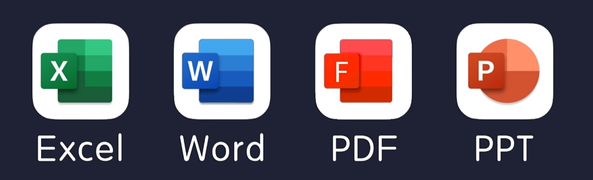

# myPython


<h3 style="color:orange;">Python可以干什么？</h3>

<h5 style="color:#ff4c00;">网络爬虫</h5>


<h5 style="color:#c91f37;">网站开发</h5>


<h5 style="color:#ff0097;">数据分析</h5>


<h5 style="color:#f20c00;">自动化办公</h5>




## 安装Python与PyCharm

[Python官网](https://www.python.org)

**1、python解释器：略**

相关命令：

```sh
# 在命令行中启用Python
python

# 查看Python版本
python -V

# 查看Python安装位置
where python
```


**2、pycharm编辑器：略**


## 入门程序

### 1、认识Python

<span style="color:blue;">Python语言</span>是一种<span style="color:red;">面向对象</span>的<span style="color:red;">解释型</span>高级编程语言。

<span style="color:blue;">Python</span>是<span style="color:red;">强类型</span>的<span style="color:red;">动态脚本语言</span>。

> 编译型语言 和 解释型语言
>
> 解释型语言：使用专门的解释器将源码程序逐行解释成特定平台的机器并立即执行，是代码在执行时才被解释器逐行动态翻译和执行，而不是在执行之前就完成翻译。
>
> 
>
> 
>
> 编译型语言：使用专门的编译器，针对特定的平台，将高级语言源代码一次性的编译成可被该平台硬件执行的机器码，并包装成该平台所能识别的可执行程序的格式。
>
> 
>
> <span style="color:red;">区别：</span>
>
> 1.编译型语言编译后就可以在平台运行，解释型语言在运行期间才编译。
>
> 2.一般来说，编译型语言**运行速度**快。
>
> 3.解释型语言**跨平台特性**比编译型语言好。


### 2、HelloWorld

①新建第一个项目


②在项目目录下新建一个hello_world.py文件，并编写如下内容


```python
print("hello world")
```

③在文件空白处点击右键，打开菜单并选择运行文件


可以在控制台查看文件运行结果


### 3、Bug与Debug

Python中常见的Bug类型有：

- 输入错误

```python
print(“123”)    # Python中的符号都要求使用英文符号
```

- 缩进错误

```python
    print("123")    # print要顶格写
```

- 语法错误

```python
print("123")print("456")    # 每个print都必须独占一行
```

- 命名错误

```python
print(hello_world)    # 字符串必须用引号包裹，单引号、双引号都可以
```


Python中设置<span style="color:red;">断点</span>与<span style="color:red;">Debug</span>：


Debug窗口的一些图标及功能：


总结：<span style="color:blue;">可以通过Debug调试看到程序执行的顺序</span>。


### 4、注释

单行注释、多行注释

```python
# 单行注释
print("单行注释")

'''
多行注释（单引号*3）
'''
"""
多行注释（双引号*3）
"""
print("多行注释")

'''
快捷键：
ctrl + /
'''
print("快捷键")
```


### 5、输出函数

```python
# print()方法用于打印输出，是最常见的一个函数
print("123")
```

参数：

- *values：值，表示可以一次输出多个对象。输出多个对象时，需要用英文逗号`,`分隔
- sep：用来间隔多个对象，默认值是一个空格
- end：用来设定以什么结尾，默认值是换行符`\n`，可以换成其他字符串

```python
print("Spring", "is", "coming", sep="_", end="!")
```


### 6、变量

变量的作用：计算机中的存储空间，用于保存数据

```python
# 变量名 = 值
# 注意：赋值运算符 =
num1 = 3
num2 = 10
total = num1 + num2
# 如果变量没有被赋值，则会报命名错误
# 变量只有在被赋值以后才会被创建，所以使用变量之前必须要赋值一次，我们称之为初始化变量
print(num1, num2, total)
```

<span style="color:red;">注意事项：</span>首次使用变量会在内存中划分空间，并初始化值；再次使用变量时不再划分空间，而是修改原空间的值。

```python
# 解释器做了两件事情：
# 1.在内存中创建了一个数据 666
# 2.创建了一个变量a，把666这个数据保存到a变量中去
a = 666
print(a)
# 同一个变量可以反复赋值，并且可以赋值不同的数据类型
a = 999
a = 6.66
a = "哈哈"
print(a)

b = a
print(b)
```


### 7、标识符

**开发人员定义的变量名、函数名**

标识符<span style="color:red;">规定</span>：

1. 只能由数字、字母、下划线组成

2. 不能以数字开头

3. 不能是关键字

4. 严格区分大小写

```python
# 定义标识符
six = 1
_six1 = 2
_2six = 3
# 错误写法
# 1_six = 6

# ========================注意项：========================
# Python3支持用中文命名标识符，但是不推荐，不符合代码的规范性
价格 = 1
print(价格)

# 用英文小括号()包裹标识符，对标识符本身没有影响
(user) = 1
print((user))
print(user)
# 错误写法
# (user)name = "ZhangSan"
# print((user)name)
# print(username)
```


<b style="color:green;">命名规范</b>

<span style="color:red;">1.见名知义</span>

<span style="color:red;">2.下划线分割法</span>

<span style="color:red;">3.大驼峰命名法</span>

<span style="color:red;">4.小驼峰命名法</span>

```python
# 下划线分割法
user_name = "Json"
# 大驼峰
UserName = "Json"
# 小驼峰
userName = "Json"
```


### 8、数值类型


<span style="color:red;">检测数据类型的方法：`type()` 函数</span>

```python
# int 整型（常用）：任意大小的整数
num1 = 1
# num1 = 10000
# num1 = -5
print(type(num1))


# float 浮点型：小数
num2 = 1.5
print(type(num2))


# bool 布尔型（重点）：有两个固定的值 True 和 False，通常用于条件判断
# 注意：True 和 False 必须严格区分大小写
print(True)
# 错误写法：print(true)


# 布尔值可以作为整数参与运算：True = 1，False = 0
print(True + False)
print(True + 1)


# complex 复数型（了解）
# 固定写法：z = a + bj，a是实部，b是虚部，j是虚数单位
print(2 + 3j)
# 虚数单位只能用字母j表示，不区分大小写
print(type(1 + 2j))
print(type(2 + 3J))
# 错误写法：print(4 + 4i)

# 复数的计算
m1 = 1 + 2j
m2 = 2 + 3j
print(m1 + m2)
```


### 9、字符串类型

```python
# 字符串特点：内容被引号包裹，单引号、双引号都可以
name = "Spring Stone"
print(name)
print(type(name))


# 当字符串包含了多行内容时，也可以使用三引号
content = """
line1
line2
line3
"""
print(content)


# 注意：多行注释与多行字符串的区别（多行注释不需要赋值给变量）
difference = """
多行
字符串
"""

"""
多行注释
print("多行注释")
"""

print(difference)
```


### 10、格式化输出

#### 占位符

占位符：用来占位的符号

占位符的作用：生成一定格式的字符串

占位符的三种方式：

1.百分号 %

```python
# 单个占位符
name = "Stone"
print("my name is %s" % name)

# 多个占位符
age = 18
print("my name is %s, my age is %d" % (name, age))


# 占位符可以格式化替换内容的长度
# 长度不足的默认补空格（若设置正整数，则空格补在前面；若设置负整数，则空格补在后面）
# 长度超过则按原样输出
num = 123
print("%4d" % num) # 输出结果：_123
content = "aaa"
print("%-4s" % content) # 输出结果：aaa_

# 也可以自定义占位符的格式化补齐内容，例如补0（只适用于开头补0，末尾补0无效）
print("%06d" % num)  # 输出结果：000123


# %f：格式化浮点数，默认格式化成6位小数
a = 1.2
print("%f" % a) # 输出结果：1.200000
b = 1.23
print("%f" % b) # 输出结果：1.230000

# 超出的小数位数遵循四舍五入原则
c = 1.2345678
print("%f" % c) # 输出结果：1.234568

# 也可以自定义设置格式化的小数位数：例如设置4位小数
print("%.4f" % a) # 输出结果：1.2000


# %%：百分号转义
print("输出一个百分号%%" % ())
```

百分号% 格式化输出

|  符号  | 描述                                 |
| :----: | ------------------------------------ |
|   %c   | 格式化字符及其ASCII码                |
| **%s** | 格式化字符串（**常用**）             |
| **%d** | 格式化整数                           |
|   %u   | 格式化无符号整型                     |
|   %o   | 格式化无符号八进制数                 |
|   %x   | 格式化无符号十六进制数               |
|   %X   | 格式化无符号十六进制数（大写）       |
| **%f** | 格式化浮点数字，可指定小数点后的精度 |
|   %e   | 用科学计数法格式化浮点数             |
|   %E   | 作用同上，用科学计数法格式化浮点数   |
|   %g   | %f 和 %e 的简写                      |
|   %G   | %F 和 %E 的简写                      |
|   %p   | 用十六进制数格式化变量的地址         |
| **%%** | 百分号转义                           |


2.format()


3.格式化 f

https://www.bilibili.com/video/BV1rpWjevEip?spm_id_from=333.788.player.switch&vd_source=71b23ebd2cd9db8c137e17cdd381c618&p=6
